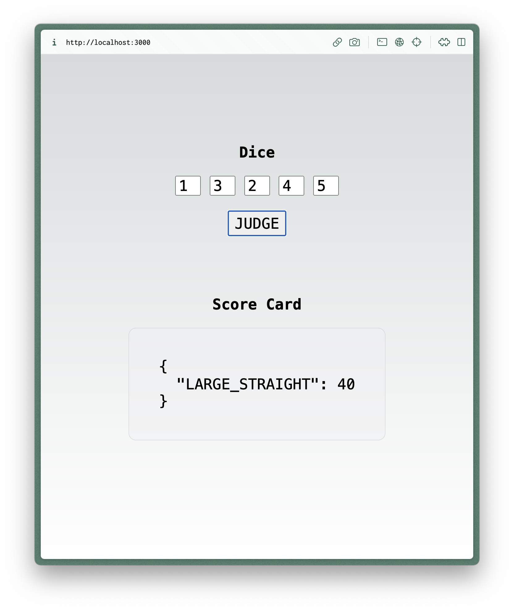

# pragma-schooner-dice
Take-home assignment for Pragma.gg interview

---

## Getting started
This is a [Next.js](https://nextjs.org/) project bootstrapped with [`create-next-app`](https://github.com/vercel/next.js/tree/canary/packages/create-next-app). It requires a NodeJS environment (I was using v20.9.0 when I made it) to run.

```bash
yarn install
# or
npm install
```

## Relevant files
To make things nicer you, I built a simple web UI to interact with the `score` and `topCategories` functions you requested. The side-effect is that there are a lot of files that are irrelevant to that core logic, many of which were generated by the bootstrap mechanism I used.

The files directly relevant to this assessment are:
- [/app/constants.ts](/app/constants.ts)
- [/app/types.ts](/app/types.ts)
- [/app/utils.ts](/app/utils.ts)
- [/\__test__/utils.test.js](/__test__/utils.test.js)

## Interacting
You can launch the web UX by running the development server:

```bash
yarn dev
# or
npm run dev
```

Open [http://localhost:3000](http://localhost:3000) with your browser and you should see a simple dice form, which allows you to submit a dice roll for judgment and then view the top categories for that roll.




## Unit tests
I also wrote a fair number of unit tests to illustrate the API. These tests are not exhaustive by any means, but you can find them in `__test__/utils.test.js` and run them via:

```bash
yarn test
# or
npm run test
```
